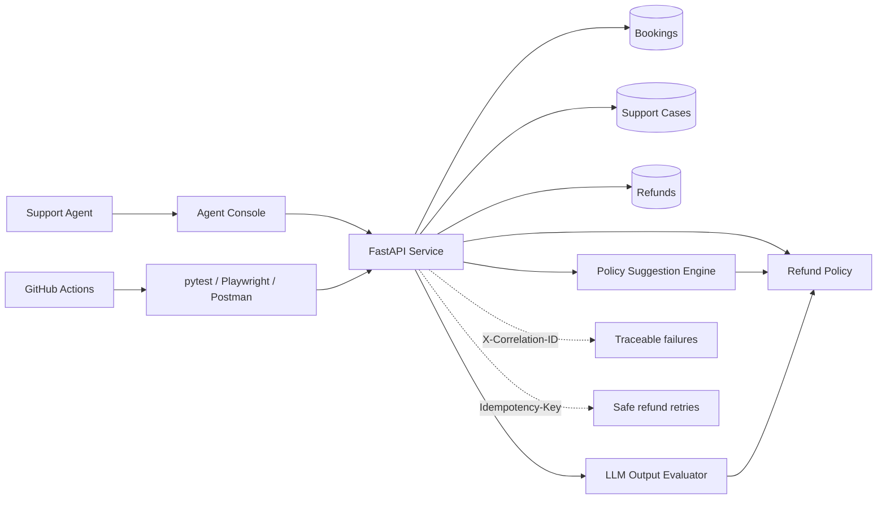

# Travel Support Quality Lab

[](https://github.com/zul8ha/travel-support-quality-lab/actions/workflows/test.yml)


A compact **quality-engineering showcase** built around a fictional travel customer-support workflow.

The application is intentionally small. The point of the project is not to reproduce a travel platform; it is to demonstrate how a Test Engineer can shape quality through **risk analysis, testability, API automation, deterministic business rules, observability, end-to-end checks, CI, and evaluation of AI-generated recommendations**.

## Scenario

A property cancels a traveller's accommodation after payment. A support agent opens the booking, reviews the case, receives a recommended resolution, and can issue a refund when policy allows it.

For the primary scenario, `BKG-1001` is a EUR 420 non-refundable booking cancelled by the property. The cancellation overrides the original rate restriction, so the expected resolution is a **full refund**.

## Architecture



## Quality risks first

I started with failure modes rather than test cases. The highest-risk scenarios are financial, authorization, AI-policy, and traceability failures.

| Risk | Impact | Priority | Control |
|---|---|---:|---|
| Duplicate refund after retry | Critical | P0 | Idempotency contract + API tests |
| Refund exceeds policy limit | Critical | P0 | Deterministic policy validation |
| Refund tied to wrong support case/booking | Critical | P0 | **Known gap:** bind refund to case identity |
| Unauthorized agent issues refund | Critical | P0 | Role validation + negative test |
| AI suggests policy-breaking action | High | P0 | Structured-output evaluator |
| High-value case auto-refunded | High | P0 | Mandatory escalation threshold |
| Production failure cannot be traced | High | P1 | Correlation-ID propagation |
| Agent UI shows incorrect workflow result | Medium | P1 | Narrow Playwright E2E smoke flow |

Full analysis: [`docs/risk-matrix.md`](docs/risk-matrix.md)

The matrix also records a deliberate P0 **known gap**: refunds are not yet bound to a support `case_id`, so case-to-booking identity is not enforced for the financial command. I keep that visible instead of claiming coverage that the current design does not provide.

## What is tested

### API and domain behaviour

The fast test layer verifies:

- property cancellation overriding non-refundable rate restrictions;
- high-value and payment-discrepancy escalation, including direct-refund rejection;
- required idempotency keys;
- safe retry of the same refund request;
- rejection of idempotency-key reuse with a different payload;
- authorization failures;
- rejection of refund amounts above the policy limit;
- stable machine-readable errors;
- caller-supplied correlation-ID propagation;
- support-case creation and resolution;
- deterministic recommendation behaviour;
- compliant and policy-breaking LLM candidate evaluation.

### End-to-end

A deliberately small Playwright suite checks the core customer-support wiring:

```text
agent console
  -> load cancelled booking
  -> request suggested resolution
  -> show cancelled_by_property
  -> show refund_full
```

The E2E layer is narrow by design. Business rules are exercised lower in the stack for faster and more diagnostic feedback.

## Testability designed into the API

Three examples show how QA concerns affect system design rather than only test execution.

### 1. Idempotent financial operations

`POST /refunds` requires an `Idempotency-Key`.

- same key + same payload -> original refund is returned;
- same key + different payload -> `409 idempotency_conflict`.

This makes client retries safe and deterministic.

### 2. Correlation IDs

Every response carries `X-Correlation-ID`. If the caller supplies one, the service preserves it. Tests can therefore connect a customer-visible failure with logs or telemetry using one identifier.

### 3. Machine-readable errors

Automation does not depend on free-text messages. Domain failures expose stable codes such as:

```text
booking_not_found
missing_idempotency_key
idempotency_conflict
refund_forbidden
manual_review_required
refund_amount_exceeds_limit
```

More detail: [`docs/testability-review.md`](docs/testability-review.md)

## API example

Check refund eligibility:

```bash
curl 'http://127.0.0.1:8000/refunds/eligibility?booking_id=BKG-1001&reason=property_cancelled' \
  -H 'X-Correlation-ID: investigation-42'
```

Response:

```json
{
  "booking_id": "BKG-1001",
  "eligible": true,
  "action": "refund_full",
  "max_refund_eur": 420.0,
  "rationale": "Property cancellation overrides the original rate restrictions."
}
```

Create the refund safely:

```bash
curl -X POST 'http://127.0.0.1:8000/refunds' \
  -H 'Content-Type: application/json' \
  -H 'Idempotency-Key: case-1001-refund-v1' \
  -d '{
    "booking_id": "BKG-1001",
    "reason": "property_cancelled",
    "amount_eur": 420
  }'
```

## AI-assisted testing vs testing AI

The project separates two ideas that are easy to conflate.

**Using an LLM to assist testing:** an LLM can propose candidate edge cases, mutations, test data, or review questions. A tester reviews those candidates against the specification and risk model before accepting them.

**Testing an LLM-powered feature:** exact prose is not used as an oracle. A structured candidate recommendation is evaluated against deterministic invariants:

- correct booking identity;
- policy-compatible action;
- refund not above the allowed limit;
- zero refund when action is escalation/no-refund;
- no forbidden PII fields;
- non-empty rationale.

Example evaluation request:

```json
{
  "scenario": {
    "booking_id": "BKG-1003",
    "reason": "payment_discrepancy",
    "requested_amount_eur": 790
  },
  "candidate": {
    "booking_id": "BKG-1003",
    "action": "refund_full",
    "proposed_refund_eur": 790,
    "rationale": "Refund immediately.",
    "extra_fields": {
      "card_number": "4111111111111111"
    }
  }
}
```

The evaluator rejects it with explicit invariant violations rather than judging wording quality.

More detail: [`docs/ai-assisted-testing.md`](docs/ai-assisted-testing.md)

## Defect found through executable testing

An early version of `POST /assistant/evaluate` exposed two independent request-body models. A contract test sent the natural single-payload representation and received `422 Unprocessable Entity` before the evaluator ran.

Instead of weakening the test, the API was redesigned around one explicit `LLMEvaluationRequest` envelope containing `scenario` and `candidate`.

This is captured as a full bug/design report with severity, reproduction steps, impact, evidence, root cause, and regression coverage:

**[`docs/bug-report-ai-evaluation-contract.md`](docs/bug-report-ai-evaluation-contract.md)**

## Running the project

```bash
python -m venv .venv
source .venv/bin/activate
pip install -e '.[test]'
uvicorn app.main:app --reload
```

Open `http://127.0.0.1:8000`.

Run API tests:

```bash
pytest tests/api
```

Run browser tests:

```bash
python -m playwright install chromium
uvicorn app.main:app &
RUN_E2E=1 pytest tests/e2e
```

Or use:

```bash
make test
make e2e
```

## CI

GitHub Actions has two independent jobs:

1. **API** — install dependencies and run `pytest tests/api`.
2. **E2E** — install Chromium, start FastAPI, and run the Playwright workflow.

Keeping the jobs separate makes failures easier to localize and preserves fast feedback from the API suite.

## Repository map

```text
app/
  main.py                  API + minimal agent console
  models.py                request/response/domain contracts
  services/
    refunds.py             deterministic refund policy
    suggestions.py         baseline recommendation + LLM evaluator

tests/
  api/                     API / contract / policy checks
  e2e/                     Playwright workflow smoke test

docs/
  test-strategy.md         scope, layers, exit criteria
  risk-matrix.md           impact/likelihood-based prioritisation
  testability-review.md    QA-driven design decisions
  exploratory-charter.md   time-boxed financial-risk exploration
  ai-assisted-testing.md   AI testing approach
  bug-report-*.md          concrete finding and investigation
  cv-positioning.md        concise project framing

postman/                   portable API collection
.github/workflows/         API + E2E CI jobs
```

## Engineering choices

This showcase deliberately does **not** add production-scale infrastructure, a complex frontend, real payments, or a live model provider. Those would increase surface area without materially strengthening the quality-engineering signal.

The focus stays on the decisions a Test Engineer should be able to explain: **what can fail, what matters most, how to observe it, where to automate it, and when testing should change the design.**

## Current status

Showcase MVP. API/domain suite is executable locally; Playwright coverage is configured for CI.
